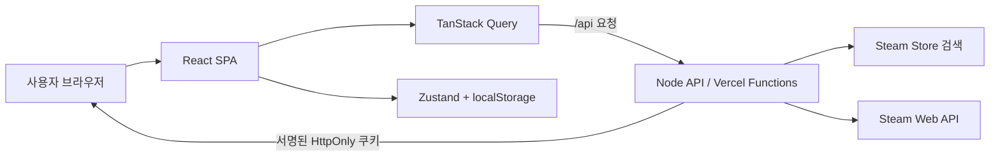

# 설계와 기술 선택

## 1. 시스템 경계

이 프로젝트는 React SPA, Steam 요청 프록시, 브라우저 로컬 데이터의 세
영역으로 나뉩니다.



- 로컬에서는 `server/steamProxy.js`가 포트 3001에서 API를 제공합니다.
- 배포 환경에서는 `api/`의 Vercel Functions 진입점이 같은 요청 처리기를
  사용합니다.
- Steam API Key는 서버 환경변수에만 있고 React 번들에는 포함되지 않습니다.
- 공략과 개인 계획 데이터는 현재 브라우저 localStorage에 저장합니다.

## 2. Steam 데이터와 사용자 데이터 분리

Steam에서 가져온 값과 사용자가 보완한 값을 하나의 사실처럼 합치지 않습니다.

| 구분 | 데이터 | 상태 관리 |
| --- | --- | --- |
| 원격 데이터 | 게임, 도전과제, 아이콘, 전체 달성률, 공개 라이브러리 | TanStack Query |
| 사용자 데이터 | 공략, 조건, 태그, 투표, 체크리스트, 관심 게임 | Zustand |
| 인증 데이터 | SteamID 세션 | 서버 서명 HttpOnly 쿠키 |

Steam API가 DLC나 멀티플레이 필요 여부를 주지 않을 때 `false`로 저장하면
“필요 없음”이라는 잘못된 정보가 됩니다. 따라서 공략 조건은 `알 수 없음`,
`필요`, `불필요` 세 상태로 모델링하고 사용자가 확인한 경우에만 조건 배지를
노출합니다.

## 3. API 프록시

브라우저에서 Steam으로 직접 요청하지 않는 이유는 다음과 같습니다.

1. Steam API Key가 클라이언트에 노출되는 것을 막습니다.
2. 브라우저 CORS 제약을 서버에서 처리합니다.
3. Steam Store 검색 결과와 Web API 응답을 화면에 필요한 형태로 정규화합니다.
4. 타임아웃, 입력 범위, 레이트 리밋을 한 계층에서 적용합니다.

주요 API 흐름은 다음과 같습니다.

| 경로 | 역할 |
| --- | --- |
| `/api/steam/store-games` | 게임 검색, 태그, 상점 정보 보강 |
| `/api/steam/apps` | 공략 작성용 최대 30개 앱 검색 |
| `/api/steam/game` | 단일 게임 상세 정보 |
| `/api/steam/achievements` | 도전과제 스키마와 전체 달성률 |
| `/api/steam/library` | 로그인 사용자의 공개 라이브러리 |
| `/api/steam/player-achievements` | 단일 게임의 개인 달성 기록 |
| `/api/steam/achievement-overview` | 라이브러리 전체 달성 기록 페이지 집계 |
| `/api/auth/*` | Steam OpenID 로그인, 세션 확인, 로그아웃 |

모든 Steam fetch에는 12초 타임아웃을 적용합니다. IP·라우트별 1분 창에서 Store
검색은 20회, 공략 앱 검색과 전체 기록 집계는 30회, 일반 게임·도전과제·프로필
조회는 60회로 제한합니다. 현재 제한은 인스턴스 메모리 기반이며 분산 운영용
전역 제한은 아닙니다.

## 4. 검색과 페이지네이션

### 게임 검색

Steam Store 검색은 25개 결과 경계로 페이지가 이동합니다. 클라이언트가 20을
다음 시작점으로 사용하면 첫 페이지가 한 번 더 반환될 수 있으므로 다음과 같이
처리합니다.

1. 서버와 클라이언트 페이지 크기를 25로 맞춥니다.
2. 서버가 `nextStart`를 25 단위로 명시해 반환합니다.
3. 클라이언트는 페이지를 합칠 때 `appid`로 한 번 더 중복 제거합니다.
4. 최초 로딩과 더보기 로딩을 구분해 스켈레톤 카드를 표시합니다.

더보기 스켈레톤은 기존 카드와 같은 CSS Grid의 자식으로 넣어 마지막 줄의 빈
칸부터 채웁니다.

### 공략 작성 검색

게임 검색과 같은 Steam Store 검색 어댑터를 재사용하되 선택 상자에는 검색어를
두 글자 이상 입력했을 때 최대 30개만 표시합니다.

- 두 화면에서 게임 이름과 `appid`가 일치합니다.
- 약 5만 개의 전체 앱 목록을 브라우저 메모리에 올리지 않습니다.
- 300ms debounce와 1시간 Query 캐시로 반복 요청을 줄입니다.

## 5. 안정적인 도전과제 식별자

배열 순번은 Steam 응답 순서가 바뀌면 같은 URL이 다른 도전과제를 가리킬 수
있습니다. 현재 도전과제 ID는 `appid + Steam 내부 도전과제 이름`을 조합한
문자열을 사용합니다.

기존 숫자 ID로 저장된 URL, 체크리스트, 투표 데이터는 상세 페이지에서 새
ID로 마이그레이션합니다. 체크리스트에는 이름·설명·아이콘 스냅샷도 함께 저장해
Steam 요청이 실패해도 사용자가 무엇을 저장했는지 확인할 수 있습니다.

## 6. 로그인과 공략 소유자

Steam 로그인은 비밀번호를 직접 받지 않는 OpenID 흐름입니다.

1. `/api/auth/steam`이 Steam 로그인 페이지로 이동시킵니다.
2. callback에서 OpenID 응답을 서버가 검증합니다.
3. 검증된 SteamID를 HMAC 서명한 HttpOnly 쿠키에 저장합니다.
4. 라이브러리와 개인 도전과제 API는 쿠키 세션을 다시 확인합니다.

공략에는 `ownerSteamId`를 저장하고 읽기·수정·삭제 시 현재 로그인 SteamID와
비교합니다. 같은 브라우저에서 여러 계정을 구분하기 위한 설계이며 서버가
쓰기 권한을 보장하는 데이터베이스 구조는 아닙니다. 소유자 정보가 없는 기존
공략은 첫 로그인 계정에 한 번 귀속해 로컬 데이터를 보존합니다.

## 7. 공략 모델

한 도전과제에는 여러 공략이 존재할 수 있습니다.

- 공략 카드는 접힌 상태에서 작성자, 난이도, 예상 시간, 조건 태그, 좋아요와
  싫어요를 먼저 보여 줍니다.
- 펼치면 힌트와 자세한 공략을 단계별로 확인합니다.
- 체크리스트에서는 현재 반응을 반영해 좋아요가 가장 많은 공략을 우선
  선택합니다.
- 좋아요·싫어요는 서로 전환하거나 같은 버튼을 다시 눌러 해제할 수 있습니다.
- 신고는 같은 브라우저 사용자 기준으로 한 번만 저장합니다.
- 예시 공략은 `source: example`인 읽기 전용 데이터이며 배지로 구분합니다.

이는 발표에서 여러 사용자의 공략이 존재하는 화면을 보여 주기 위한 MVP입니다.
실제 커뮤니티로 운영하려면 공략, 반응, 신고를 서버 데이터베이스로 옮기고
권한과 운영 정책을 추가해야 합니다.

## 8. localStorage 안전성

TypeScript 타입은 빌드 이후 localStorage 값까지 검증하지 못합니다. 저장 값은
`{ version, data }` 형태로 감싸고 읽을 때 다음을 확인합니다.

- 식별자와 문자열 타입
- enum에 허용된 값
- 음수가 될 수 없는 숫자
- 공략과 체크리스트의 필수 필드
- 투표·반응·신고의 허용된 값

이전 비버전 데이터는 현재 스키마로 마이그레이션합니다. 앱보다 새로운 버전은
임의로 덮어쓰지 않으며, 저장 공간 부족이나 보안 설정으로 쓰기가 실패해도
화면 전체가 중단되지 않게 합니다.

## 9. 성능 설계

- 모든 라우트 페이지를 `React.lazy`로 분리합니다.
- Recharts 홈 차트는 화면에서 320px 이내에 접근할 때만 import합니다.
- 마이페이지 라이브러리 이미지는 지연 로딩하며 CDN 이미지 실패 시 대체 경로와
  placeholder를 사용합니다.
- 마이페이지 라이브러리는 20개씩 화면에 추가합니다.
- 전체 달성 기록은 서버가 30개 게임 단위로 처리하고 Steam 요청을 최대 6개씩
  병렬 실행합니다.
- 클라이언트는 250ms 간격으로 다음 집계 페이지를 요청해 전체 기록을 자동으로
  완성합니다.
- TanStack Query의 `staleTime`으로 화면 이동 시 같은 데이터를 반복 요청하지
  않습니다.

## 10. 오류 처리와 접근성

- 전역 Error Boundary가 예상하지 못한 렌더링 오류를 받아 다시 불러오기와
  홈 이동을 제공합니다.
- 각 Query 화면은 로딩, 빈 결과, API 오류를 구분합니다.
- 폼 입력은 `label`, 오류 연결, `role="alert"`를 사용합니다.
- 본문 바로가기와 시맨틱 landmark를 제공합니다.
- 장르 선택 상자와 공략 탭은 키보드로 조작할 수 있습니다.
- 진행률과 로딩 상태는 `aria-live`, `aria-busy`, `progressbar` 속성으로
  전달합니다.
- 색만으로 완료나 선택 상태를 구분하지 않고 텍스트와 배지를 함께 사용합니다.

## 11. 품질 검사

```bash
npm run check
```

`check`는 다음을 순서대로 실행합니다.

1. Oxlint
2. Vitest
3. strict TypeScript 검사
4. Vite 프로덕션 빌드

현재 순수 로직 중심의 11개 테스트 파일, 33개 테스트가 다음 규칙을 검증합니다.

- 도전과제 안정 ID와 이전 ID 변환
- SteamID별 공략 소유권
- localStorage 스키마와 버전 마이그레이션
- 공략 좋아요·싫어요·신고
- 공략 좋아요 순위
- 예시 공략 분리
- 추천 최대 3개 규칙
- 예상 시간 범위 변환
- 게임 검색 도전과제 개수 필터
- Store 페이지 병합 중복 제거

GitHub Actions는 pull request와 `main` push에서 같은 명령을 실행합니다.

## 12. 선택하지 않은 기술

| 기술 | 사용하지 않은 이유 |
| --- | --- |
| Tailwind·CSS Module·Styled Components·Emotion | 디자인 토큰과 역할별 일반 CSS로 통일 |
| Redux Toolkit·Recoil·Jotai | 현재 전역 상태 규모에는 Zustand로 충분 |
| Axios·SWR | Fetch와 TanStack Query가 같은 책임을 담당 |
| Next.js·SSR | Vite SPA와 CSR이 프로젝트 범위에 적합 |
| JWT | 브라우저 JavaScript에서 읽지 않는 HttpOnly 세션 쿠키 사용 |
| 데이터베이스 | 프론트엔드 상태·API 연동 평가를 우선한 MVP 범위 |

기술을 많이 추가하는 것보다 각 책임에 하나의 도구만 두는 방향을 선택했습니다.
